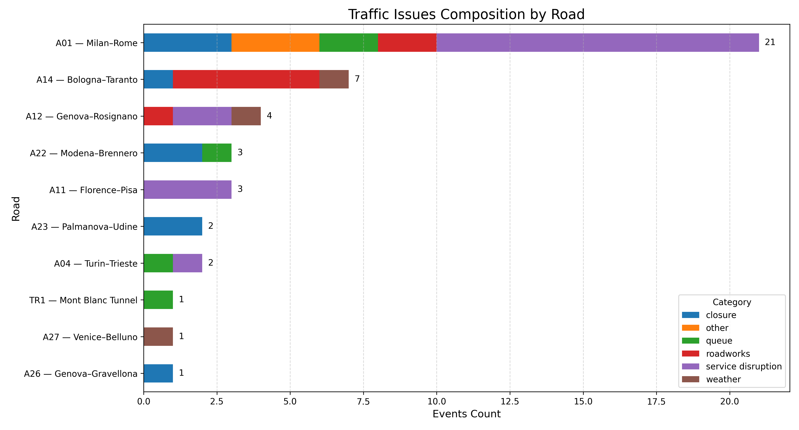

## Project Structure

```bash
italy-traffic-intelligence/
│
├── analyze_events.py
├── summarize_events.py
├── plot_events.py
├── inspect_endpoint.py
├── requirements.txt
├── README.md
│
├── data/
│   ├── events_by_category.csv
│   ├── events_by_road.csv
│   ├── main_issue_by_road.csv
│   └── road_category_summary.csv
│
├── charts/
│   └── stacked_traffic_issues_horizontal.png
│
└── .env
```

---

## Installation

```bash
pip install -r requirements.txt
```

---

## Environment Variables

```env
TRAFFIC_ENDPOINT=your_endpoint_here
```

---

## Run Pipeline

Download and process traffic events:

```bash
python3 analyze_events.py
```

Generate summaries:

```bash
python3 summarize_events.py
```

Create charts:

```bash
python3 plot_events.py
```

---

## Example Chart



---

## Data Source

Traffic event data is collected from publicly accessible motorway traffic feeds used by Italian traffic information systems.

The project is intended for educational, analytical and portfolio purposes only.

---

## Author

Yurii Vasylenko